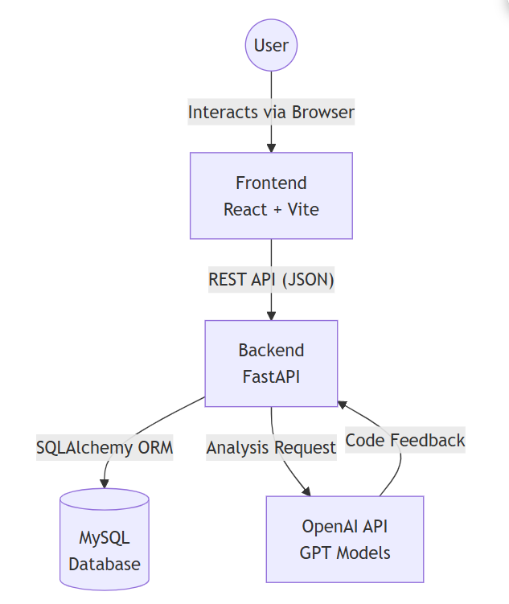

# Welcome to Rookie Route repository 🚀

  

  **AI-Powered Code Review & Vulnerability Analysis Service**
 
  *Level up your coding habits with personalized AI feedback.*

  
  
  
  
  

---

## 📖 Project Overview

**Rookie Route** is an open-source educational tool designed to help novice developers improve their coding skills. By leveraging **OpenAI's API**, it analyzes code logic, syntax, and style, providing actionable feedback and visualizing weakness patterns through an interactive dashboard.

### 🔗 Quick Links

- **Website**: [Project Homepage](https://rookie-route.github.io/rookie-route-repository)

- **Documentation**: 

- **Discord Community**: [Join our Discord](https://discord.gg/qzEBPv6bAV)

---

## 📂 Main Repository Files

A list of important documents and configuration files found in the root directory of this repository.

- **README.md**: The document you are currently viewing, which includes the project overview and installation guides.

- **CONTRIBUTING.md**: Guidelines for contributors, including code style, pull request procedures, and ways to get involved.

- **CODE_OF_CONDUCT.md**: Standards for community behavior to ensure a welcoming environment for all contributors.

- **LICENSE**: The licensing information for the Rookie Route project (Apache-2.0).

- **run_server.bat**: A Windows batch script to start both Backend (FastAPI) and Frontend (React) servers simultaneously.

- **run_jekyll.bat**: A Windows batch script to serve the static project website locally using Jekyll.

- **Gemfile**: Configuration file for Ruby dependencies, used for building the Jekyll website.

- **_config.yml**: The main configuration file for the Jekyll site settings.

---

## 🏗️ System Architecture & Flow

This project is divided into two main components: the **Frontend (React.js)** and **the Backend (FastAPI)**, managed within a single Monorepo.

Below is the core process by which a user's code analysis request is handled.

### Core Process Flow

1. **User Input**: The user inputs and submits their code via the Frontend interface.

2. **Request Transmission**: The Frontend sends the code analysis request to the Backend (FastAPI) REST API using a secure JWT token.

3. **AI Analysis and Storage**: The Backend receives the request, calls the **OpenAI API** to perform analysis, and saves the results to the **MySQL Database**.

4. **Feedback Return**: The analyzed feedback is returned to the Frontend and displayed to the user.

5. **Dashboard Support**: The Backend aggregates statistical data from MySQL and provides visualization data.

---

## ✨ Key Features

- **🔐 Authentication & Security**: Secure Signup/Login utilizing **OAuth2** (Password Flow) and **JWT** (HS256).

- **🤖 AI Code Analysis**: Integrates with GPT models to detect logic errors, syntax issues, and efficiency problems.

- **📊 Interactive Dashboard**: Visualizes user growth and weakness statistics using Chart.js.

- **💾 Data Persistence**: Securely stores submissions and analysis history using SQLAlchemy ORM.

- **📄 Automatic Documentation**: Provides interactive API documentation via Swagger UI.

---

## 🛠️ Installation & Setup

For detailed step-by-step instructions (Mac/Linux support, manual setup), please refer to the **[Getting Started Guide](docs/source/getting_started.md)**.

### ✅ Prerequisites

- **Python** 3.11+

- **Node.js** 18+ (LTS)

- **MySQL** 8.0+

### ⚡ Quick Start (Windows)

If you are on Windows, you can start both servers at once using the provided batch script:

1.  Clone the repository.

2.  Double-click **`run_server.bat`** in the root directory.

3.  Both **Backend** and **Frontend** servers will launch automatically.

### 🌐 Access Points

Once the servers are running, you can access the application at:

- **Frontend UI**: [`http://localhost:5173`](http://localhost:5173)

- **Backend API Docs**: [`http://localhost:8000/docs`](http://localhost:8000/docs)

### 🔧 Manual Setup

If you need to configure environment variables (`.env`) or run servers individually, please check the **[Getting Started Guide](docs/source/getting_started.md)**.

---

## 📂 Backend File Structure Details

Here is a detailed explanation of the backend codebase located in app/backend/.

* **back_main.py:** The entry point of the application. It initializes the FastAPI app, connects the database engine, and registers the routers.

* **database.py:** Handles the database connection setup using SQLAlchemy.

* **models.py:** Defines the database schema (ORM models) for Submission and Weakness.

* **schemas.py:** Defines Pydantic data schemas for request/response validation.

* **security.py:** Handles password hashing (bcrypt) and JWT token operations.

* **routers/:** Contains the API route logic (auth.py, review.py, dashboard.py).

* **dependencies.py:** Authentication dependency to verify current user.

* **check.py:** Utility script to verify OpenAI API key configuration.

---

## 📂 Frontend File Structure Details

Here is a detailed explanation of the frontend codebase located in app/frontend/.

* **index.html:** The main HTML entry point.

* **src/index.jsx:** The JavaScript entry point that mounts the React application.

* **src/App.jsx:** The main component that handles routing and global layout.

* **src/pages/:** Contains the top-level page components.

* **Home.jsx:** The landing page.

* **Login.jsx / Signup.jsx:** Authentication pages.

* **AnalyzePage.jsx:** The core page for code submission and AI analysis.

* **src/components/:** Reusable UI components.

* **CodeEditor.jsx:** The text area component for users to input code.

* **AnalysisResult.jsx:** Displays the AI-generated feedback.

* **ErrorTypeChart.jsx / ImprovementTrendChart.jsx:** Visualization charts for the dashboard.

* **Header.jsx:** The navigation bar.

* **vite.config.mjs:** Configuration file for the Vite build tool.

* **tailwind.config.js:** Configuration file for Tailwind CSS styling.

---

## 🤝 Contribution & Community

We welcome contributions! Please refer to the separate **[CONTRIBUTING.md](CONTRIBUTING.md)** document for details.

For questions, discussions, or support, please visit our **[Community Page](community.md)** or contact us via **[Contact](contact.md)**.

---

## 📄 License

This project is licensed under the **Apache-2.0 License** - see the **[LICENSE](LICENSE)** file for details.