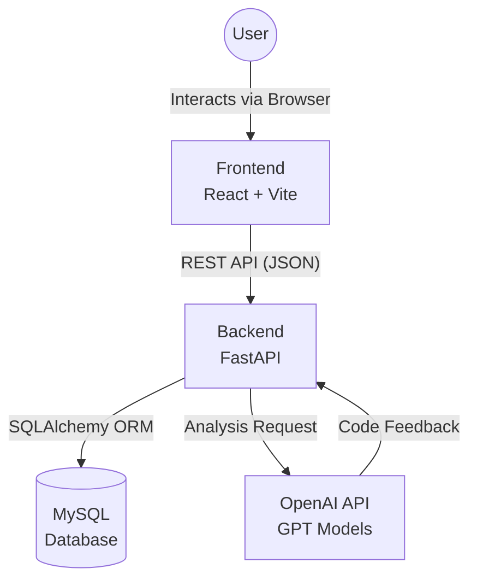
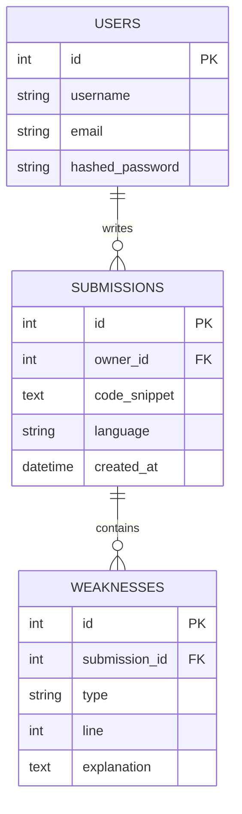
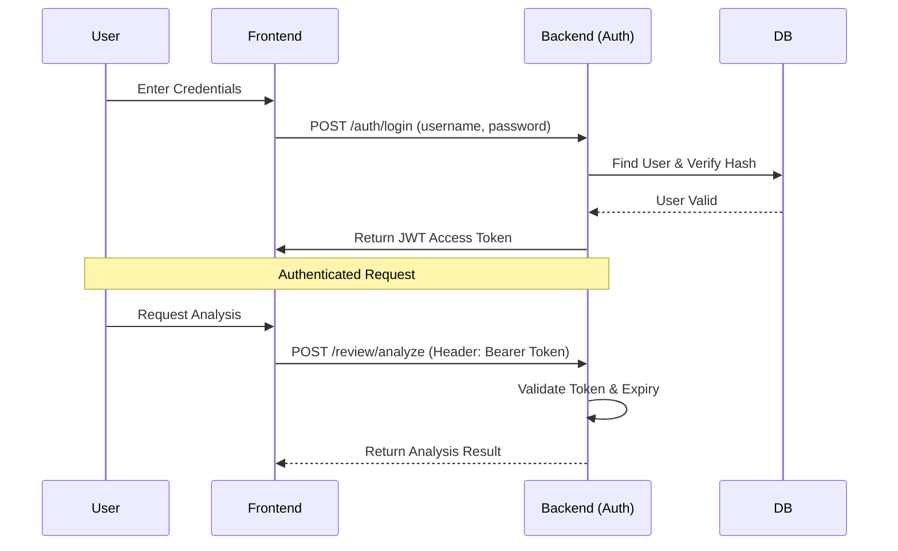

# Technical Overview

This document provides a comprehensive technical overview of the **RookieRoute** backend system, detailing the monorepo structure, database schema, security implementation, and core logic flow.

---

## 🏗️ System Architecture

RookieRoute follows a **Layered Architecture** within a Monorepo structure. The Frontend and Backend communicate via RESTful APIs, while the Backend orchestrates data persistence and AI analysis.



## 📂 Project Structure
The project is organized into two main directories under app/:

```
rookie-route-repository/
└── app/
    ├── backend/                # 🐍 FastAPI Application
    │   ├── routers/            # API Route handlers (auth, review, dashboard)
    │   ├── back_main.py        # Application Entry Point
    │   ├── check.py            # Utility: OpenAI Key Verification Script
    │   ├── database.py         # DB Connection & Session Management
    │   ├── dependencies.py     # Dependency Injection (Auth Validation)
    │   ├── models.py           # SQLAlchemy ORM Models
    │   ├── schemas.py          # Pydantic Schemas (DTOs)
    │   ├── security.py         # Cryptography & Token Logic
    │   └── .env                # Backend Configuration
    │
    └── frontend/               # ⚛️ React Application
        ├── src/                # Component & Logic Source
        └── vite.config.mjs     # Vite Configuration
```

## 💾 Database Schema (ERD)
We use SQLAlchemy to model the data. The schema is designed to efficiently store user submissions and their analysis results.


Note: The weaknesses table is configured with cascade="all, delete-orphan", ensuring that if a submission is deleted, its associated weakness records are also automatically removed.

## 🔐 Security Implementation
RookieRoute implements industry-standard security protocols to protect user data.

1. Authentication Flow

    The system uses OAuth2 Password Bearer Flow with JWT (HS256).



2. Password Hashing

    Passwords are never stored in plain text. We use bcrypt (via passlib) for secure hashing and verification.

    Implementation: See backend/security.py.

3. Request Validation (dependencies.py)

    Every protected endpoint uses the get_current_user dependency:

    Extracts the Bearer token from the request header.

    Decodes the token using the SECRET_KEY.

    Validates the sub (username) payload.

    Queries the database to confirm the user exists.

## 🤖 Core Logic: AI Code Analysis
The analysis pipeline transforms raw code into structured feedback.

Input: User submits code via POST /review/analyze.

Processing:

The backend constructs a prompt for the OpenAI API.

The model analyzes the code for Logic Errors, Syntax Issues, and Style Violations.

Parsing: The unstructured text response is parsed into WeaknessDetail objects defined in schemas.py.

Persistence: The results are saved to the MySQL database for future dashboard visualization.

---
Last Updated: v1.0.0
